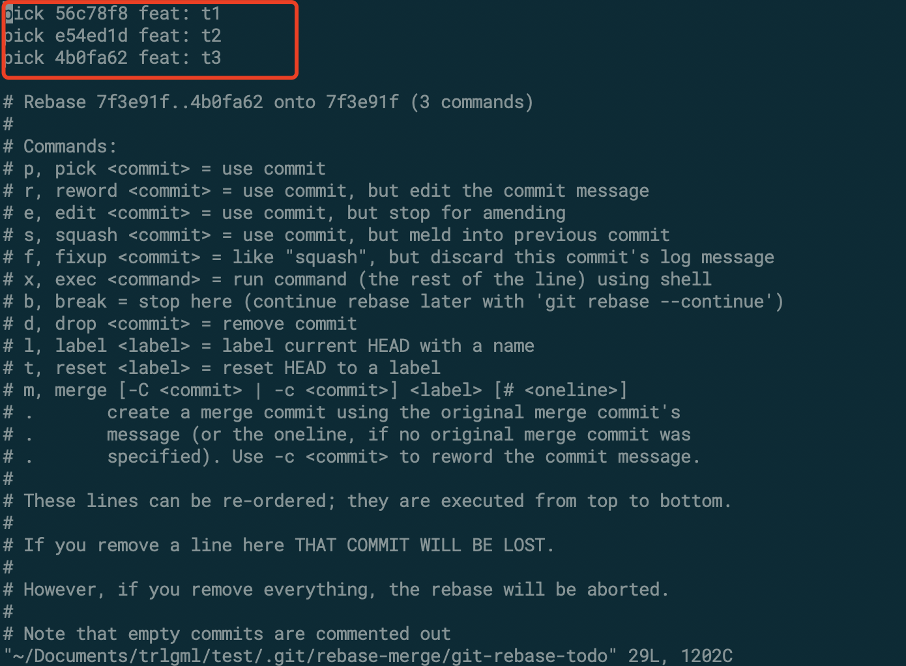
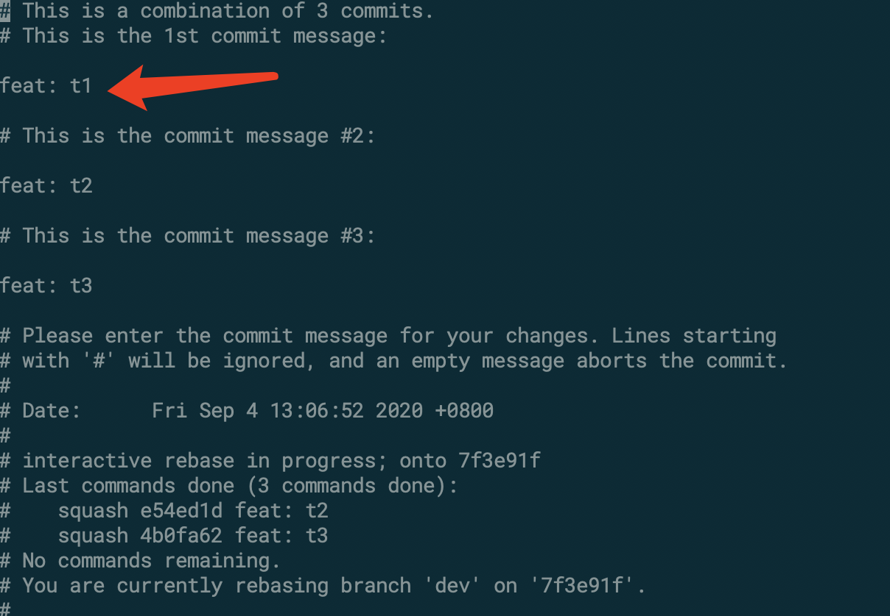

## 格式

```
git rebase -i [startpoint] [endpoint]
```

> 其中 `-i` 的意思是 `–interactive`，即弹出交互式的界面让用户编辑完成合并操作。

> `[startpoint] [endpoint] `则指定了一个编辑区。

> 如果不指定`[endpoint]`，则该区间的终点默认是当前分支HEAD所指向的commit(注：该区间指定的是一个前开后闭的区间)。

```
# 合并从当前head到指定commit_id
git rebase -i commit_id

# 合并最近的四次提交
git rebase -i HEAD~4
```

> 类型说明
```
pick：保留该commit（缩写:p）
reword：保留该commit，但我需要修改该commit的注释（缩写:r）
edit：保留该commit, 但我要停下来修改该提交(不仅仅修改注释)（缩写:e）
squash：将该commit和前一个commit合并（缩写:s）
fixup：将该commit和前一个commit合并，但我不要保留该提交的注释信息（缩写:f）
exec：执行shell命令（缩写:x）
drop：我要丢弃该commit（缩写:d）
```

## 操作

- `git rebase -i HEAD~3`




- 把后两个的pick改成squash或s之后`:wq!`进入下一个交互页面



- 箭头方向就是合并后的commit内容，可以进入编辑模式修改，之后`:wq!`保存退出