## Charles抓取电脑模拟器的网络请求
> 选择工具栏Proxy，确认勾选MAC OS X Proxy选项即可完成代理设置

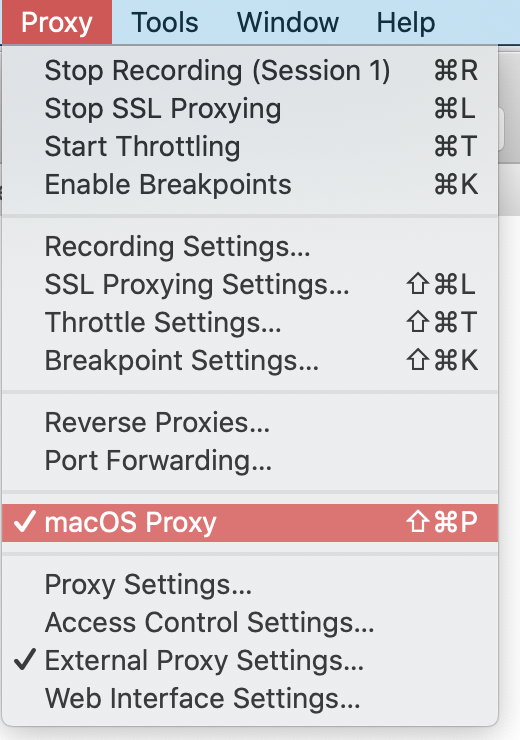

## Charles抓取手机的网络请求

> 手机和电脑必须在一个局域网内

1. 进入 Charles - Proxy - Proxy Setting，设置http proxy代理端口：8888（一般默认设置为这个）

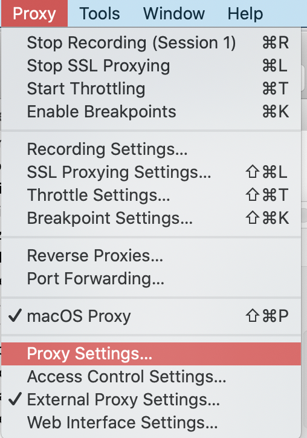
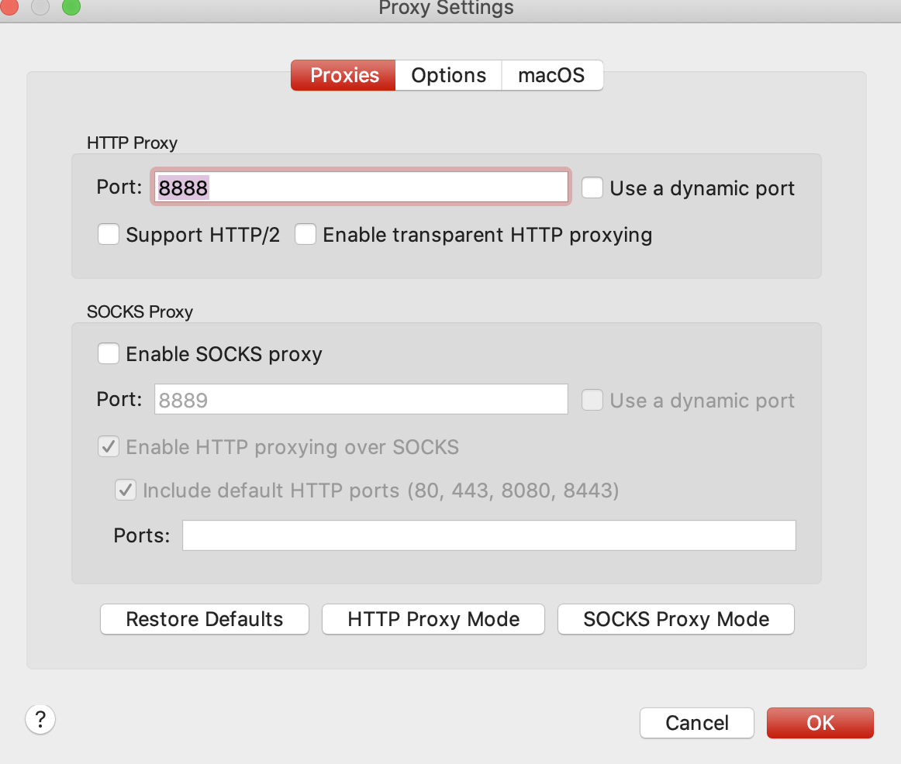

2. 手机端Wifi添加代理

> 点击你所连接的wifi - 配置代理 - 选择手动 - 输入代理服务器的IP与端口

>  系统偏好设置 - 网络 - 高级或通过终端ifconfig命令查看

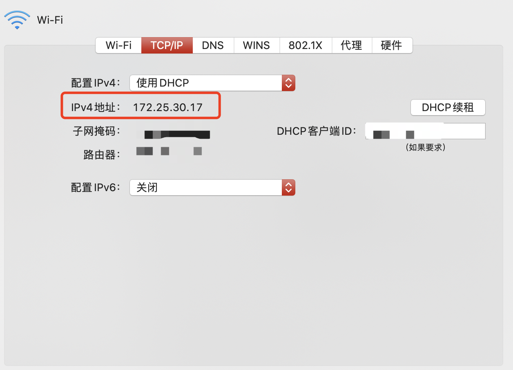

3. 当手机连接上代理后Charles会弹出相应的提示框，点击Allow即可

## Charles抓取手机的网络请求(https)

1. Mac安装证书 Charles - Help - SSL Proxying - Install Charles Root Certificate

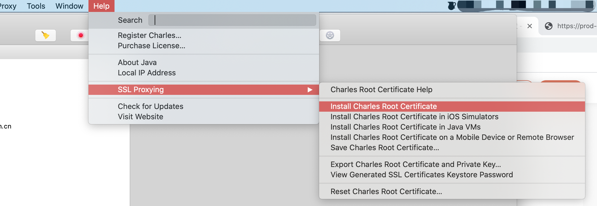

2. 手机安装证书 Charles - Help - SSL Proxying - Install Charles Root Certificate on a Mobile Device

> 弹框显示安装地址，我这里显示的是 「chls.pro/ssl」，手机访问此地址后进行证书的安装。

> 证书安装完成后，在「设置 - 通用 - 关于本机 - 证书信任设置 - 针对根证书启用完全信任」

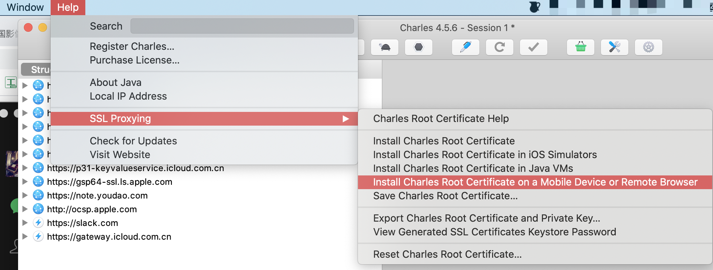
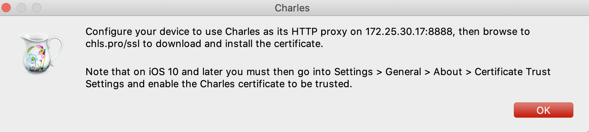

3. 设置 Proxy Charles - Proxy - SSL Proxying Settings

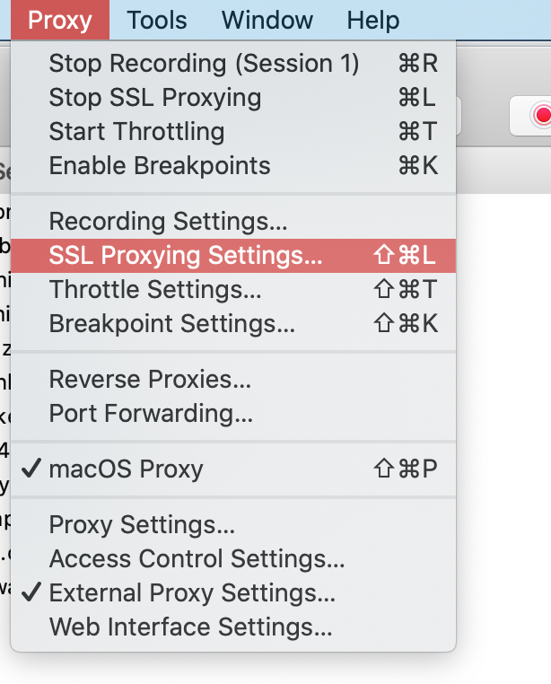
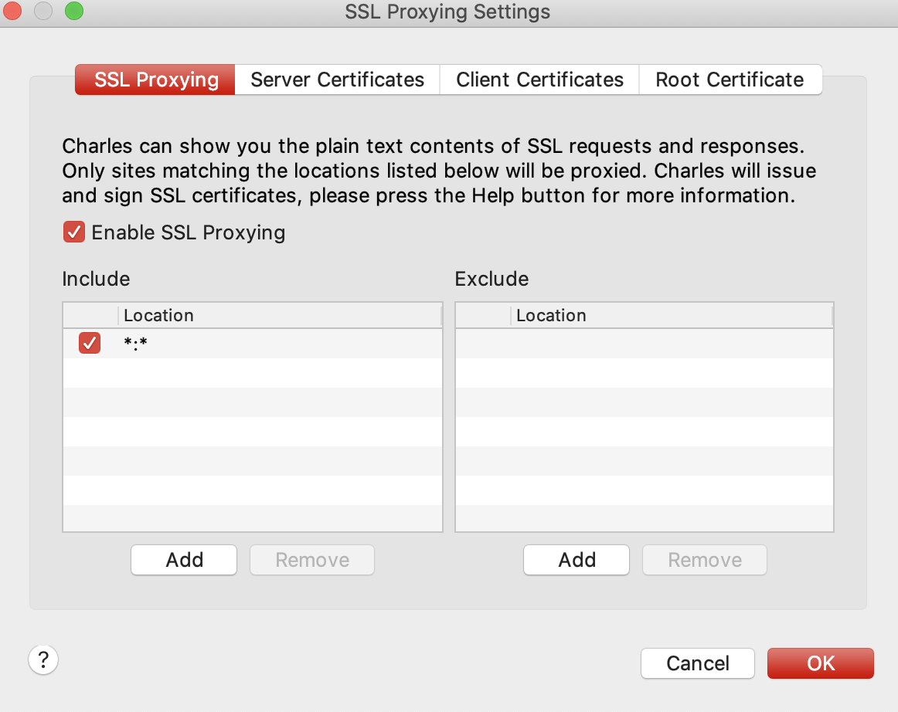

## Charles 翻墙代理 

> 如果要抓取手机端的请求，先在手机端正常配置代理，然后就可以抓取了，不需要打开手机的翻墙软件

> Charles - Proxy - External Proxy Settings 然后勾选所有选项

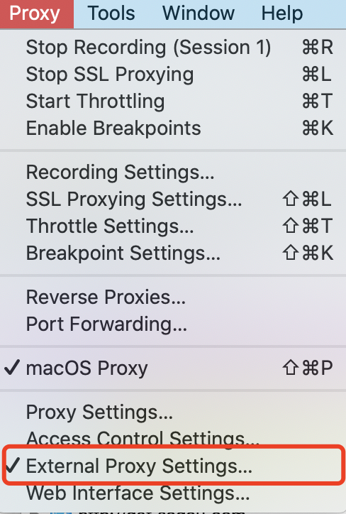
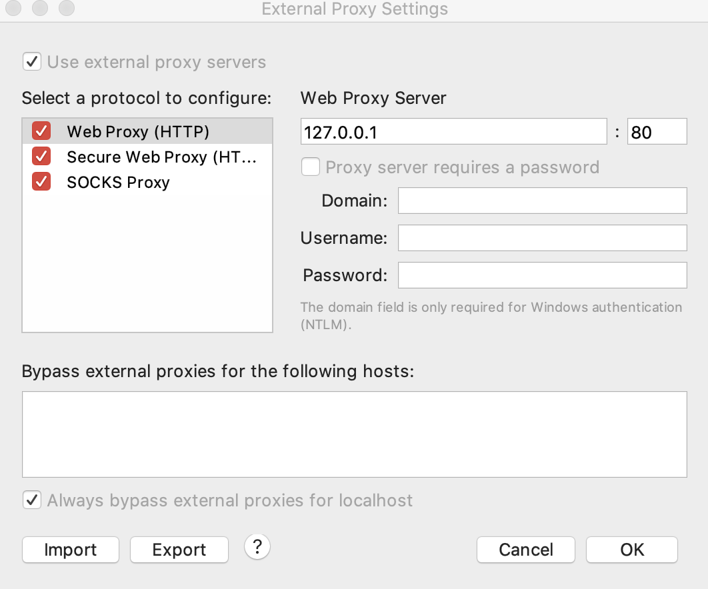

